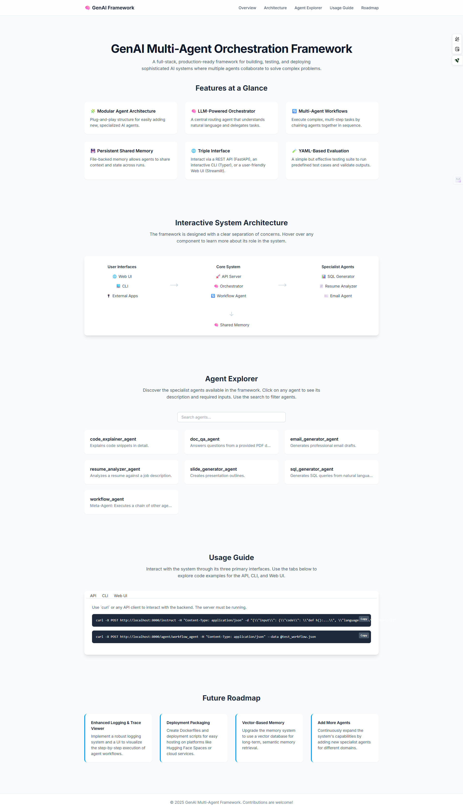
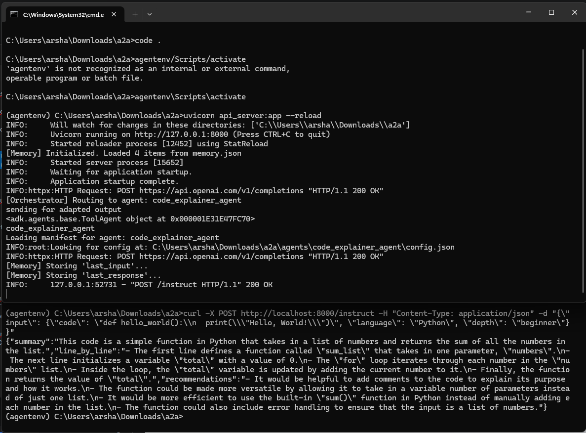
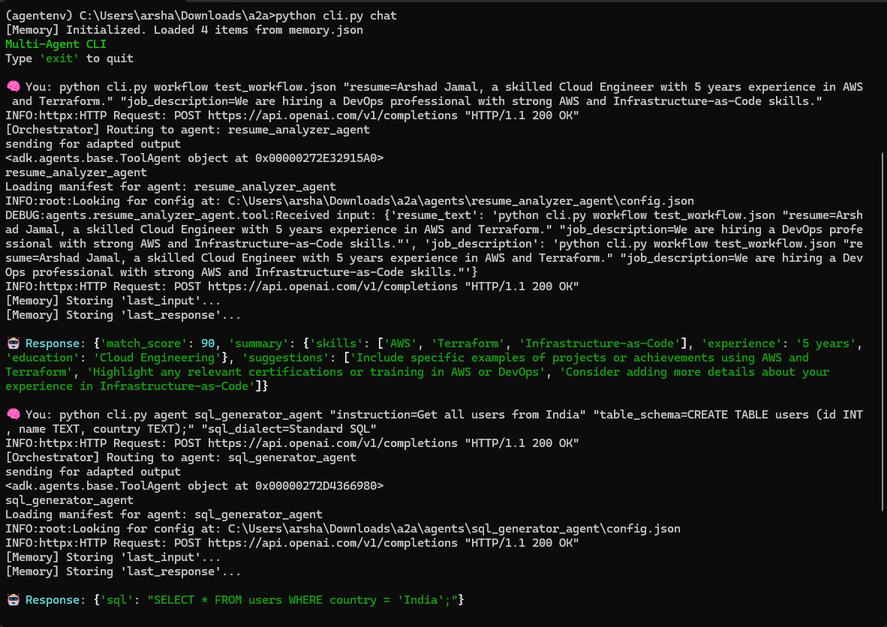
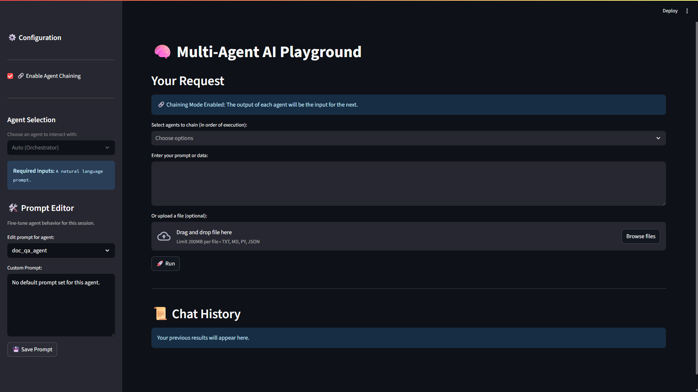

# GenAI Multi-Agent Orchestration Framework

A full-stack, production-ready framework for building, testing, and deploying sophisticated AI systems where multiple agents collaborate to solve complex problems.

Welcome to a new paradigm of AI application development. This framework moves beyond single-purpose AI tools to a cohesive ecosystem where specialized agents work in concert, orchestrated by a central intelligence and accessible through a rich suite of interfaces. From backend API to a polished web UI, this project provides every component needed to bring advanced agentic workflows to life.

---
## Live Interactive Demo

This README is also available as a full, interactive web application. Explore the system's features, architecture, and usage in a more dynamic way.

**[➡️ View the Live Interactive README](https://arshadjamal6002.github.io/agents/)**

<!-- [](https://arshadjamal6002.github.io/agents/) -->

## 📜 Table of Contents

- [🎯 Core Philosophy](#-core-philosophy)
- [✨ Features at a Glance](#-features-at-a-glance)
- [🏗️ System Architecture](#-system-architecture)
- [🛠️ Technology Stack](#-technology-stack)
- [🚀 Getting Started: A Step-by-Step Guide](#-getting-started-a-step-by-step-guide)
- [💻 A Tour of the System: How to Use It](#-a-tour-of-the-system-how-to-use-it)
- [🤖 The Agent Roster](#-the-agent-roster)
- [🗺️ Future Roadmap](#-future-roadmap)
- [🤝 How to Contribute](#-how-to-contribute)

---

## 🎯 Core Philosophy

This framework is built on three key principles:

- 🧩 **Modularity**: Each component—from individual agents to the UI—is decoupled and self-contained. This makes the system easy to extend, test, and maintain. Adding a new AI capability is as simple as creating a new agent.
- 🧪 **Testability**: A system is only as good as its reliability. With a built-in evaluation suite, you can create repeatable tests to validate agent performance and ensure that new changes don't break existing functionality.
- 🤝 **Usability**: Powerful AI should be accessible. With a REST API, an interactive CLI, and a polished Streamlit UI, the system caters to developers, testers, and end-users alike, making it perfect for both development and demonstration.

---

## ✨ Features at a Glance

| Feature                    | Description                                                                                   | Status |
|---------------------------|-----------------------------------------------------------------------------------------------|--------|
| Modular Agent Architecture | Plug-and-play structure for adding new, specialized AI agents.                               | ✅     |
| LLM-Powered Orchestrator   | A central routing agent that understands natural language and delegates tasks.              | ✅     |
| Multi-Agent Workflows      | A meta-agent that executes multi-step tasks by chaining other agents.                       | ✅     |
| Persistent Shared Memory   | File-backed memory (`memory.json`) to share context across sessions.                        | ✅     |
| REST API                   | FastAPI backend with clean, documented endpoints.                                            | ✅     |
| Interactive CLI            | Typer-based CLI for rapid testing and interaction.                                          | ✅     |
| Streamlit Web UI           | Feature-rich UI with prompt editor and workflow builder.                                     | ✅     |
| Live Prompt Engineering    | Edit/save agent master prompts live via sidebar.                                            | ✅     |
| YAML-Based Evaluation      | Test suite to validate agents using YAML test cases.                                        | ✅     |

---

## 📷 Screenshots

> Showcasing the CLI, Web UI, and overall agent workflows.

### 🔹 CURL via FastAPI



### 🔹 CLI Agent Interaction



### 🔹 Web UI



---

## 🏗️ System Architecture

The framework is designed with a clear separation of concerns, enabling scalability and maintainability.

graph TD
    subgraph User_Interfaces
        A[Streamlit Web UI]
        B[Command-Line (CLI)]
        C[External Apps]
    end

    subgraph Core_System
        D[FastAPI Server]
        E[Orchestrator Agent]
        F[Workflow Agent]
    end

    subgraph Specialist_Agents
        G[Doc QA Agent]
        H[Email Agent]
        I[Code Explainer]
        J[SQL Generator]
        K[Other Agents]
    end

    subgraph Shared_State
        L[Shared Memory (memory.json)]
    end

    A --> D
    B --> D
    C --> D

    D --> E
    D --> F
    D --> G
    D --> H
    D --> I
    D --> J
    D --> K

    E --> G
    E --> H
    E --> I
    E --> J
    E --> K

    F --> G
    F --> H
    F --> I
    F --> J
    F --> K

    F --> L
    G --> L
    H --> L
    I --> L
    J --> L
    K --> L


---

## 🛠️ Technology Stack

- **Backend**: Python 3.10+, FastAPI, Uvicorn  
- **AI/LLM**: LangChain, OpenAI  
- **CLI**: Typer, Rich  
- **Web UI**: Streamlit  
- **Tooling**: python-dotenv, PyYAML  

---

## 🚀 Getting Started: A Step-by-Step Guide

### 1. Prerequisites
- Python 3.10 or newer
- An OpenAI API key

### 2. Installation & Setup

**Clone the Repository**

```bash
git clone <your-repo-url>
cd <your-project-directory>
```

**Create and Activate a Virtual Environment**

```bash
# Windows
python -m venv venv
.env\Scriptsctivate

# macOS/Linux
python3 -m venv venv
source venv/bin/activate
```

**Install Dependencies**

```bash
pip install -r requirements.txt
```

**Configure Your API Key**

Create a `.env` file in the root directory:

```env
OPENAI_API_KEY="sk-..."
```

---

## 💻 A Tour of the System: How to Use It

### Testing the Core Components

Test the orchestrator’s routing logic:

```bash
python -m scripts.test_orchestrator
```

Test a specific agent (e.g., Code Explainer):

```bash
python -m scripts.test_code_explainer
```

Run the evaluation suite:

```bash
python -m evaluations.eval_runner
```

---

### Running the Full System

Start the backend API server:

```bash
uvicorn api_server:app --reload
```

API is live at: `http://localhost:8000`

---

### Interacting via the REST API

Call the orchestrator with a structured input:

```bash
curl -X POST http://localhost:8000/instruct   -H "Content-Type: application/json"   -d "{"input": {"code": "def hello_world():\n  print(\"Hello, World!\")", "language": "Python", "depth": "beginner"}}"
```

Run a workflow:

```bash
curl -X POST http://localhost:8000/agent/workflow_agent   -H "Content-Type: application/json"   --data @test_workflow.json
```

---

### Using the Command-Line Interface (CLI)

Start interactive chat:

```bash
python cli.py chat
```

Call specific agent:

```bash
python cli.py agent sql_generator_agent   "instruction=Get all users from India"   "table_schema=CREATE TABLE users (id INT, name TEXT, country TEXT);"   "sql_dialect=Standard SQL"
```

Run workflow with overrides:

```bash
python cli.py workflow test_workflow.json   "resume=Arshad Jamal, a skilled Cloud Engineer with 5 years experience in AWS and Terraform."   "job_description=We are hiring a DevOps professional with strong AWS and Infrastructure-as-Code skills."
```

Inspect shared memory:

```bash
python cli.py mem
```

---

### Using the Streamlit Web UI

Start the UI:

```bash
streamlit run ui.py
```

---

## 🤖 The Agent Roster

| Agent Name             | Required Inputs                             | Description                                    |
|------------------------|----------------------------------------------|------------------------------------------------|
| `code_explainer_agent` | code, language, depth                        | Explains code snippets in detail.              |
| `doc_qa_agent`         | pdf_path, question                           | Answers questions from a provided PDF.         |
| `email_generator_agent`| purpose, content, tone                       | Generates professional email drafts.           |
| `resume_analyzer_agent`| resume_text, job_description                 | Analyzes a resume against a job description.   |
| `slide_generator_agent`| topic, bullets                               | Creates presentation outlines.                 |
| `sql_generator_agent`  | instruction, table_schema, sql_dialect       | Generates SQL queries from natural language.   |
| `workflow_agent`       | steps, initial context                       | Meta-agent to execute other agents in sequence.|

---

## 🗺️ Future Roadmap

- [ ] Enhanced Logging & Trace Viewer  
- [ ] Deployment Packaging with Docker  
- [ ] Vector-Based Memory (e.g., ChromaDB, Pinecone)  
- [ ] Add More Specialist Agents  

---

## 🤝 How to Contribute

Contributions are welcome! Please:

1. Fork the repository  
2. Create a new branch:

```bash
git checkout -b feature/YourFeature
```

3. Commit your changes:

```bash
git commit -m 'Add some feature'
```

4. Push to your branch:

```bash
git push origin feature/YourFeature
```

5. Open a Pull Request

---
